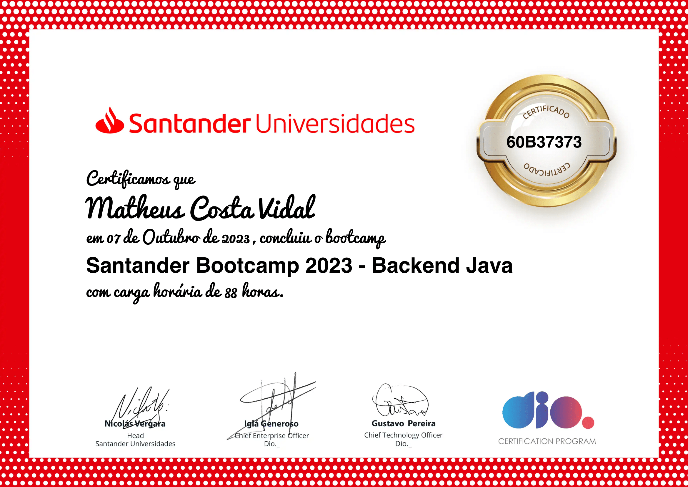

# ☕️ Santander Bootcamp 2023 - Backend Java

### 🚀 Bem-vindo ao meu repositório do Bootcamp de Java da Digital Innovation One!
Bem-vindo ao repositório do Santander Bootcamp 2023 - Backend Java! Este é um programa de treinamento intensivo focado no desenvolvimento de habilidades em Java e backend de sistemas.Este repositório foi criado para armazenar exemplos e atividades relacionados ao bootcamp. Ao longo do curso, compartilehi códigos de exemplo, projetos práticos e exercícios que me ajudaram a consolidar o conhecimento e as habilidades que estou adquirindo.

## 📋 Visão Geral
O Santander Bootcamp 2023 é uma iniciativa de aprendizado intensivo que abrange uma ampla variedade de tópicos relacionados ao desenvolvimento de software, com foco especial em Java e tecnologias de backend. Durante este bootcamp, tive a oportunidade de aprimorar suas habilidades técnicas, aprender com mentores experientes e trabalhar em projetos práticos.

## 📚 Conteúdo do Bootcamp

O bootcamp é dividido em sete cursos que abordam tópicos essenciais para o desenvolvimento de software backend:

1. **`Princípios de desenvolvimento de software:`** Este curso fornece uma introdução aos princípios fundamentais do desenvolvimento de software. Aprendi a usar o Git e o GitHub para o controle de versões de código. Além disso, tive a oportunidade de contribuir para projetos de código aberto no GitHub, ganhando experiência prática em colaboração com outros desenvolvedores.
2. **`Conhecendo a Linguagem de Programação Java:`** Neste curso, fui apresentado à linguagem de programação Java. Aprendi os conceitos básicos, como sintaxe, ambiente de desenvolvimento Java e estruturas condicionais. Também foi possível criar um projeto prático, como simular uma conta bancária, para aplicar o que aprenderam.
3. **`Resolvendo seus primeiros desafios de código:`**  Este curso foca no desenvolvimento de habilidades de resolução de problemas e lógica de programação. Enfretei desafios de código que variam em complexidade, o que me ajudou a aprimorar minhas habilidades de pensamento computacional e aperfeiçoar suas habilidades de programação.
4. **`Programação Orientada a Objetos com Java:`** A programação orientada a objetos (POO) é um conceito fundamental na programação Java. Neste curso, explorei os fundamentos da POO, os pilares da orientação a objetos em Java e como trabalhar com estruturas de dados complexas, como Collections. Além disso, criei diagramas de classes UML para entender e representar relações entre objetos.
5. **`Praticando sua abstração no domínio bancário:`** Este curso envolve a aplicação de conceitos aprendidos em Java e POO no contexto de um domínio específico - o bancário. Resolvi desafios relacionados à abertura de contas, heranças bancárias e outros tópicos bancários, ganhando experiência prática na aplicação de conceitos de programação em cenários do mundo real.
6. **`Primeiros passos em SQL e NoSQL:`** Este curso me introduziu aos bancos de dados relacionais (SQL) e não relacionais (NoSQL). Aprendi os fundamentos de SQL e exploram o cenário crescente de bancos de dados NoSQL. Isso me proporcionou uma base sólida para lidar com armazenamento e recuperação de dados em aplicativos backend.
7. **`Ganhando produtividade com Spring Framework e Java:`** Neste último curso, me apronfundei no Spring Framework, uma estrutura popular para desenvolvimento Java. Aprendi sobre gerenciamento de dependências, testes unitários, desenvolvimento web com Spring Boot e criação de APIs REST documentadas com o Spring Web e Swagger. Além disso, explorei padrões de projetos e publiquei minha API na nuvem usando tecnologias atuais, como Java 17 e Railway.

Cada curso é projetado para proporcionar uma base sólida em cada tópico e inclui desafios práticos para reforçar o aprendizado.

## 🎓 Certificado de conclusão do Bootcamp

  

